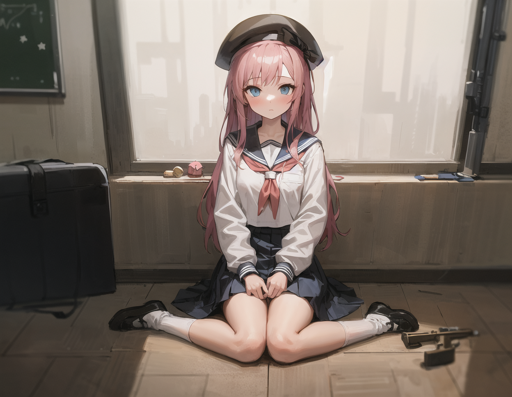

# GITT
git shell tutorial

<!-- [image](image/1.png) -->
```bash
git clone  https://github.com/Tokoshie/GITT.git

git status

# [修改编辑文档]

git add .
#添加到staging[暂存区]

# [编辑操作]

git commit -m "your change submission"
#打包提交注释和内容到 local repo

git push origin main
# clone来自自己的create/fork的库时，直接push到[源]origin的main分支
# 会出现login 而passwork推荐使用 https://github.com/settings/tokens 申请的token

#[PR/ pull request]
# pull request [PR]拉去请求，fork后修改bug/新功能添加 推荐new branch以便和main分离功能

git remote -v 
# 查看远程库信息[your own repo and someone else's repo]

git remote add source https://github.com/Tokoshie/GITT.git
#指定fork的库来源为远程库

git pull origin main
#同下列操作：同步origin的更新内容到本地main分支

git fetch source
#拉取最新的源库代码
git checkerout main
#切换到本地[你需要push的远程分支]
git merge source/main
# 合并source源的main分支到本地

# [进行编辑代码操作]

git add . / git commit -m "something" 
git push origin main
# push到你fork的main分支


```
<!-- <p>

<p>文本注释1</p>
</p>
</n> 
|文本注释：||
||描述文字|-->
---
<div style="display: flex; align-items: flex-start;">
   <div style="flex: 3;">
        
    </div>
    <div style="flex: 3; padding-left: 20px;">
        ((masterpiece, best quality)),a girl, solo, twintails, shirt, skirt, petals, bowtie, earrings, jewelry, bangs, black hair, hair ornament, hair ribbon, red ribbon, red eyes, long hair, open mouth, white shirt, multicolored hair, black skirt, red hair, long sleeves, pink bowtie, hair between eyes, looking at viewer, collared shirt, upper body, hand up, falling petals, depth of field, strong bloom, red background
Negative prompt: (low quality, worst quality:1.4), (bad anatomy), (inaccurate limb:1.2),bad composition, inaccurate eyes, extra digit,fewer digits,(extra arms:1.2),
Steps: 20, Sampler: DPM++ SDE Karras, CFG scale: 6.0, Seed: 2577623252, Size: 640x384, Model hash: 8838e0d1fb, Model: Counterfeit-V2.0, Denoising strength: 0.6, Clip skip: 2, Hires upscale: 2, Hires upscaler: Latent
    </div>
</div>

---
<div style="display: flex; align-items: flex-start;">
    <div style="flex: 3;">
        
    </div>
    <div style="flex: 3; padding-left: 20px;">
        ((masterpiece, best quality)),a girl, solo, twintails, shirt, skirt, petals, bowtie, earrings, jewelry, bangs, black hair, hair ornament, hair ribbon, red ribbon, red eyes, long hair, open mouth, white shirt, multicolored hair, black skirt, red hair, long sleeves, pink bowtie, hair between eyes, looking at viewer, collared shirt, upper body, hand up, falling petals, depth of field, strong bloom, red background
Negative prompt: (low quality, worst quality:1.4), (bad anatomy), (inaccurate limb:1.2),bad composition, inaccurate eyes, extra digit,fewer digits,(extra arms:1.2),
Steps: 20, Sampler: DPM++ SDE Karras, CFG scale: 8, Seed: 320807752, Size: 640x384, Model hash: f3b033b02f, Model: Counterfeit-V2.0, Denoising strength: 0.6, Clip skip: 2, Hires upscale: 2, Hires upscaler: Latent
    </div>
</div>

---
<div style="display: flex; align-items: flex-start;">
    <div style="flex: 3;">
        
    </div>
    <div style="flex: 3; padding-left: 20px;">
        ((masterpiece, best quality)),a girl, solo, twintails, shirt, skirt, petals, bowtie, earrings, jewelry, bangs, black hair, hair ornament, hair ribbon, red ribbon, red eyes, long hair, open mouth, white shirt, multicolored hair, black skirt, red hair, long sleeves, pink bowtie, hair between eyes, looking at viewer, collared shirt, upper body, hand up, falling petals, depth of field, strong bloom, red background
Negative prompt: (low quality, worst quality:1.4), (bad anatomy), (inaccurate limb:1.2),bad composition, inaccurate eyes, extra digit,fewer digits,(extra arms:1.2),
Steps: 20, Sampler: DPM++ SDE Karras, CFG scale: 8, Seed: 320807752, Size: 640x384, Model hash: c743a8da49, Model: dsmile_st_uo, Denoising strength: 0.6, Clip skip: 2, Hires upscale: 2, Hires upscaler: Latent
    </div>
</div>

---
<div style="display: flex; align-items: flex-start;">
    <div style="flex: 3;">
        
    </div>
    <div style="flex: 3; padding-left: 20px;">
        ((masterpiece, best quality)),a girl, solo, hat, blush,long hair, skirt, beret, sitting, bangs, socks, wariza, pink hair, light blue eyes, black headwear,holding,rifle,weapon, looking at viewer, white sailor collar, school uniform, closed mouth, black hat, sailor collar, holding weapon, long sleeves, pleated skirt, white socks,indoors,industrial
        Negative prompt: (low quality, worst quality:1.4), (bad anatomy), (inaccurate limb:1.2),bad composition, inaccurate eyes, extra digit,fewer digits,(extra arms:1.2),
        Steps: 20, Sampler: DPM++ SDE Karras, CFG scale: 8, Seed: 2480113831, Size: 576x448, Model hash: 8838e0d1fb, Model: Counterfeit-V2.0, Batch size: 3, Batch pos: 0, Denoising strength: 0.6, Clip skip: 2, Hires upscale: 2, Hires upscaler: Latent
    </div>
</div>

